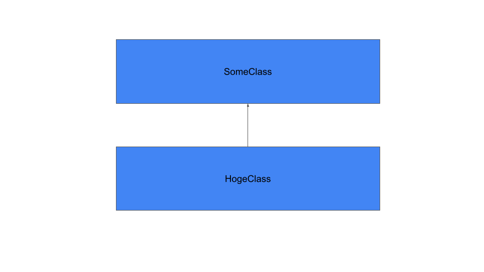

はじめに

つぎに

# Introduction2
This API is documented in **OpenAPI format** and is based on
[Petstore sample](http://petstore.swagger.io/) provided by [swagger.io](http://swagger.io) team.
It was **extended** to illustrate features of [generator-openapi-repo](https://github.com/Rebilly/generator-openapi-repo)
tool and [ReDoc](https://github.com/Redocly/redoc) documentation. In addition to standard
OpenAPI syntax we use a few [vendor extensions](https://github.com/Redocly/redoc/blob/main/docs/redoc-vendor-extensions.md).

## 二段階目タイトル
- [petstore](./gen/petstore.html)

### 3段目
[health](./gen/health.html) 参照

## もいちど2段目

# OpenAPI Specification
This API is documented in **OpenAPI format** and is based on
[Petstore sample](http://petstore.swagger.io/) provided by [swagger.io](http://swagger.io) team.
It was **extended** to illustrate features of [generator-openapi-repo](https://github.com/Rebilly/generator-openapi-repo)
tool and [ReDoc](https://github.com/Redocly/redoc) documentation. In addition to standard
OpenAPI syntax we use a few [vendor extensions](https://github.com/Redocly/redoc/blob/main/docs/redoc-vendor-extensions.md).

# Cross-Origin Resource Sharing
少しでも生産的に.
All responses have a wildcard same-origin which makes them completely public and accessible to everyone, including any code on any site.

# Authentication

Petstore offers two forms of authentication:
    - API Key
    - OAuth2
OAuth2 - an open protocol to allow secure authorization in a simple
and standard method from web, mobile and desktop applications.

<SecurityDefinitions />

テスト

|hoge|foo|
|-----|----|
|aaa|bbb|